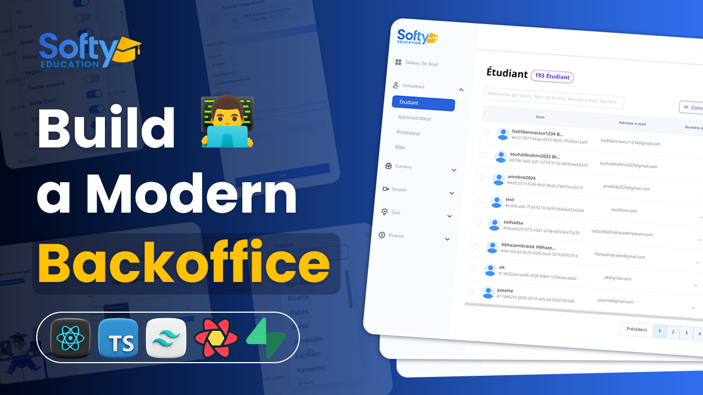

# Modern Backoffice with ReactJS and Supabase 🚀



This project is a fully functional Modern Backoffice for managing student data, built using modern web development tools. It features a robust backend powered by Supabase and a sleek, responsive frontend using React and Vite.

### Watch Full Tutorial  👇
You can watch the full tutorial on YouTube [here](https://youtu.be/KnXI9Zjqzcg).

### Explore More Online Trainings and Courses 🔥
For more online training and courses, check out our website: [www.softyeducation.com](https://www.softyeducation.com)


## Features 🧩

### Student Management 

- **CRUD Operations**: Add, delete, and update student records seamlessly.
- **Pagination**: Navigate large datasets efficiently.
- **Filters**: Narrow down results by phone number range, region, course, and creation date.
- **Search**: Quickly find students by name.
- **Customizable Columns**: Show or hide table columns as needed.

### Authentication

- **Secure Login**: User authentication managed via Supabase.
- **Role-Based Access**: Protect routes with `AuthGuard` and `GuestGuard` for secure navigation.

### UI/UX Features

- **Design**: Built with Tailwind CSS for a mobile-friendly experience.
- **Ant Design Integration**: Pre-styled components for an elegant UI.
- **Fast Loading**: Vite ensures optimized builds and blazing-fast development.

---

## Tech Stack 🧑‍💻

### Frontend

- **React**: Component-based architecture for a dynamic UI.
- **Vite**: A modern frontend tooling for rapid development.
- **Tailwind CSS**: Utility-first CSS framework for styling.
- **Ant Design (AntD)**: Sleek, pre-designed UI components.

### Backend

- **Supabase**: A powerful, open-source backend as a service for database and authentication.

### Libraries

- **React Router DOM**: Client-side routing for SPA navigation.
- **React Hook Form**: Easy and performant form handling.
- **React Query**: Manage server state and caching for a smoother user experience.

---

## Installation

### Prerequisites

- Node.js (>= 14.x)
- npm or yarn
- A Supabase account and project

### Steps

1. **Clone the Repository**

   ```bash
   git clone https://github.com/yourusername/admin-dashboard.git
   cd admin-dashboard
   ```

2. **Install Dependencies**

   ```bash
   npm install
   # or
   yarn install
   ```

3. **Set Up Supabase Client**
   Create a `supabaseClient.ts` file in the root directory with the following:

```typescript
import { createClient } from "@supabase/supabase-js";

const supabaseUrl = "<YOUR_SUPABASE_URL>";
const supabaseKey = "<YOUR_SUPABASE_ANON_KEY>";

export const supabase = createClient(supabaseUrl, supabaseKey);
```

Replace `<YOUR_SUPABASE_URL>` and `<YOUR_SUPABASE_ANON_KEY>` with your Supabase project credentials.

4. **Run the Development Server**

   ```bash
   npm run dev
   # or
   yarn dev
   ```

5. **Build for Production**
   ```bash
   npm run build
   # or
   yarn build
   ```

---

## License

This project is licensed under the [MIT License](LICENSE).

---

## Contributions

Contributions are welcome! Please fork the repository and submit a pull request.

---

## Acknowledgments

- [Supabase](https://supabase.com/)
- [React](https://reactjs.org/)
- [Tailwind CSS](https://tailwindcss.com/)
- [Ant Design](https://ant.design/)
- [Vite](https://vitejs.dev/)
